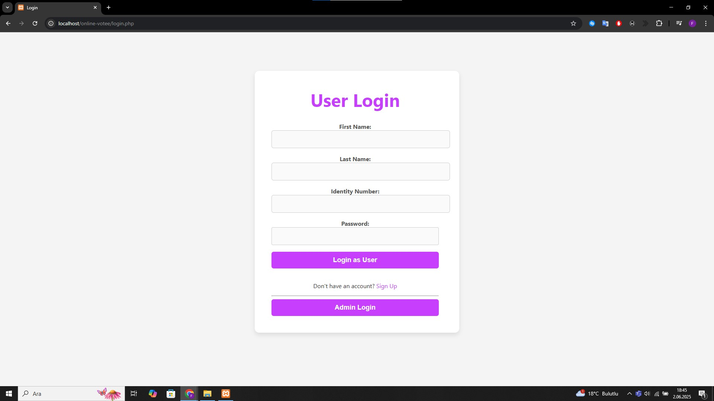
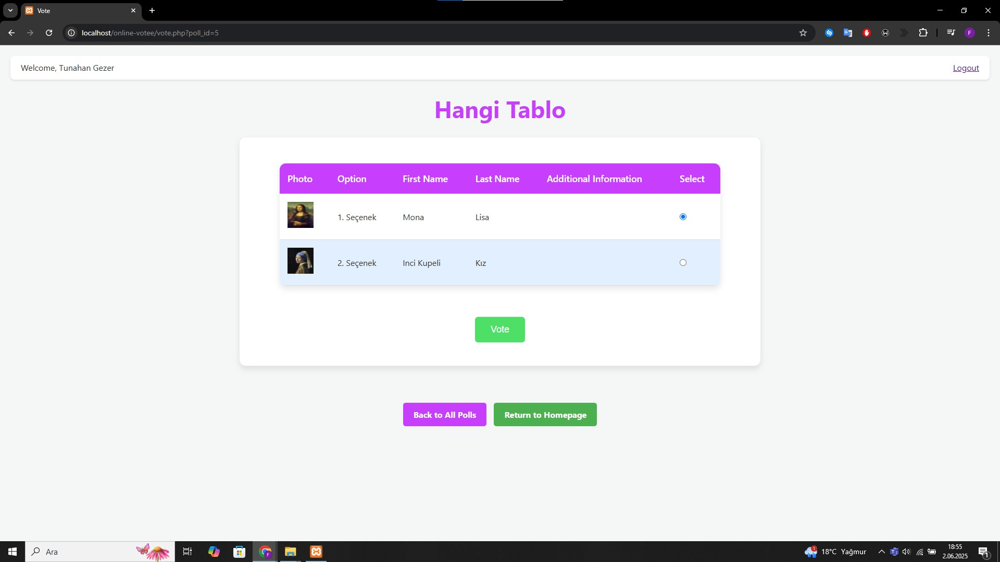
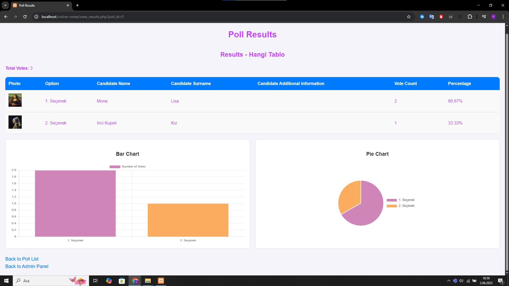

# 🗳️ Online Voting System

A simple and secure web-based **Online Voting System** built with **PHP**, **MySQL**, **HTML**, **CSS**, and **JavaScript**. This system supports two user roles: **Admin** and **Voter**, and is ideal for schools, institutions, or small organizations looking to digitize voting processes.

---

## 📸 Screenshots

### 🔐 Login Page


### 🗳️ Voting Page


### 📊 Results Page


---

## 👥 User Roles

### 🛡️ Admin
- Login with predefined credentials
- Add / Edit / Delete candidates
- Manage voters
- View real-time results with graphs
- Track system logs and activities

### 👤 Voter
- Secure login
- Can vote **only once**
- Can update password

---

## 🔐 Admin Credentials

```text
Username: admin
Password: 1234
